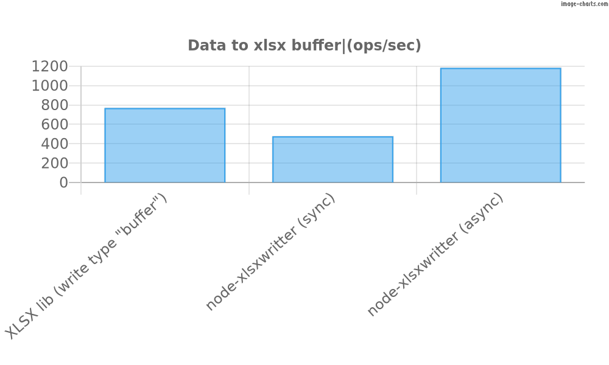
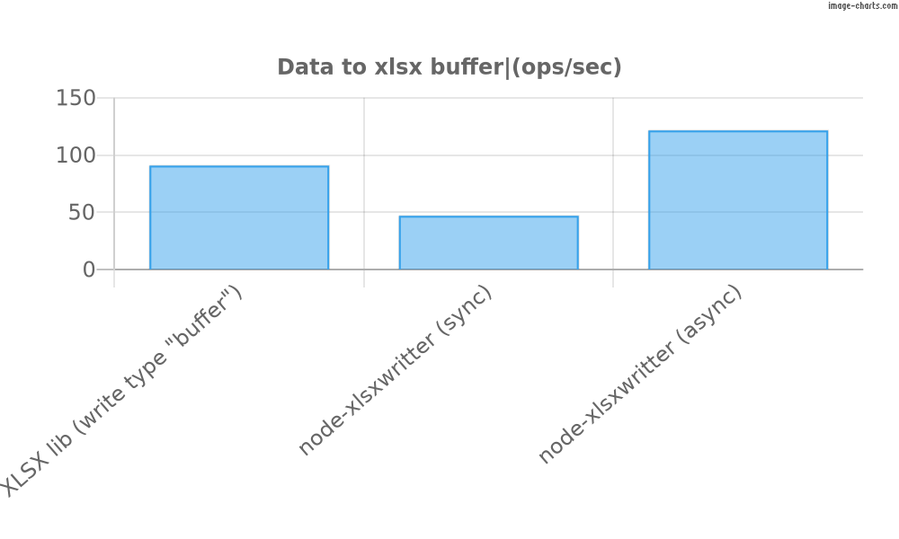
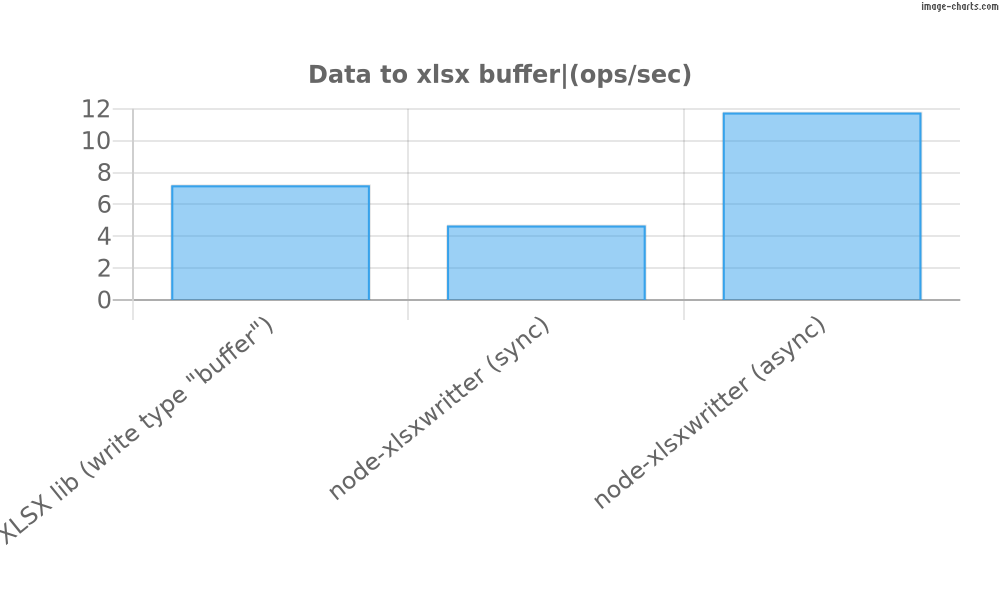

# Node-xlsxwriter
node-xlsxwriter is a Node.js wrapper for the Rust library [rust_xlsxwriter](
  https://docs.rs/rust_xlsxwriter/0.64.2/rust_xlsxwriter/index.html).

It allows you to create Excel files in the `.xlsx` format,with a high level of performance,in a simple way.

## Installation
```bash
npm install node-xlsxwriter
```

## Usage
```javascript
const { Workbook, Sheet, Format, Color, Border } = require('node-xlsxwriter');
/*
import * as xlsx from 'node-xlsxwriter';
const { Workbook, Sheet, Format, Color, Border } = xlsx;
for typescript/Es6
*/

const workbook = new Workbook();
const sheet = new Sheet('SomeSheet');
sheet.addColumnConfig({
  index: 0,
  size: {
    value: 30,
  },
});
sheet.addColumnConfig({
  index: 1,
  size: {
    value: 30,
  },
});
const format = new Format({
  align: 'center',
  bold: true,
  backgroundColor: new Color({ red: 255 }),
  fontSize: 16,
  underline: 'double',
  fontScheme: 'minor',
  fontName: 'Arial',
});

format.setBorder(new Border('thin', new Color()));
// const sheet = workbook.addSheet(); if you don't care about the name
sheet.writeString(0, 0, 'Hello');
sheet.writeNumber(1, 0, 123);
sheet.writeLink(2, 0, new Link('http://example.com', 'Example', 'tooltip'));
sheet.writeCell(3, 0, 'World', 'string');
sheet.writeString(0, 1, 'Hello', format);
workbook.pushSheet(sheet); // not necessary if you use addSheet

const buffer = workbook.saveToBufferSync();
const asyncBuffer = await workbook.saveToBuffer();
const path = 'path/to/file.xlsx';
const base64 = workbook.saveToBase64Sync();
workbook.saveToFileSync(path);
```

You also can use the `writeFromJson` method to create a sheet from a JSON object.

```javascript
 const objects = [
    {
      name: 'John',
      age: 30,
      website: new Link('http://example.com', 'Example', 'tooltip'),
      date: new Date(),
    },
    {
      name: 'Jane',
      age: 25,
      website: new Link('http://example.com', 'Example', 'tooltip'),
      date: new Date(),
    },
  ];

  const workbook = new Workbook();
  const sheet = workbook.addSheet();
  sheet.writeFromJson(objects);

  const buffer = await workbook.saveToBuffer();
```

Obs: The `writeFromJson` method trades performance for convenience,
so if are only generating the JSON for the sheet and not using anywhere else, it's better to use the `writeCell` method instead.

# More complex examples
More complex examples can be found in the `javascript/docs` folder.

# Why?
The main goal of this project was a solution of a problem that i was having with [excel4node](https://www.npmjs.com/package/excel4node) witch  and latter [xlsx](https://www.npmjs.com/package/xlsx).

I needed to take a bunch of data (50.000 rows) and put it in a simple Excel file, but the libraries mentioned above were taking too long or blocking my Event loop, excel4node was especially slow, xlsx was faster, but still blocking the event loop and i could't find a easy way to make it non-blocking.

No hate to these libraries, they are great, and much more complete,tested and used than this one, but they were not meeting my needs.

So i decided to create this project,using Rust to do the heavy lifting,using [Neon](https://neon-rs.dev) i could easily spawn an async task that was faster for my use cases and non-blocking.

So if you need to generate simple Excel files with a high level of performance, this project is for you 😄.

[rust_xlsxwriter](https://docs.rs/rust_xlsxwriter/0.64.2/rust_xlsxwriter/index.html) offers a lot of features, but i'm still working on the API to expose all of them, so if you need a feature that is not implemented yet, please open an issue or a PR.
There are a lot of room for improvement, on the performance too,especially on the serialization of the data, but i'm getting great results with this project.
But for the simple stuff, it's already working.

# Benchmarks
Every benchmark on run on a 100000ms time on this PC:
- Linux 5.15.146.1-microsoft-standard-WSL2 x64
- Node.JS: 20.12.2
- V8: 11.3.244.8-node.19
- CPU: AMD Ryzen 7 5800X 8-Core Processor × 16
- Memory: 16 GB

100 rows x 7 columns:


1000 rows x 7 columns:


10_000 rows x 7 columns:


# Warnings ⚠️

## Binary
The installation process will automatically download the `./native/node-xlsxwriter.node` binary for your system, but if you have any problems, you can download it manually from the [releases page](
  https://github.com/VictorRibeiroLima/node-xlsxwriter/releases
).

## Work in progress 
Remember that this project is still in development, so some features may not work as expected.

Also, the API may change in the future.

Any help is welcome.

## Format
Formats you can and should reuse them, because they are cached internally, so you can save memory and improve performance.
The same goes for conditional formats.

Example:

`don't do this`
```javascript
for (let i = 0; i < 100; i++) {
  const format = new Format();
  sheet.writeString(0, i, 'Hello', format);
}
```

`do this`
```javascript
const format = new Format();
for (let i = 0; i < 100; i++) {
  sheet.writeString(0, i, 'Hello', format);
}
```

The impact is not noticeable in small files, but it can be significant in large files.

# Building from source
If you want to build the project from source, you need to have Rust [installed](https://www.rust-lang.org) on your machine.

```bash
git clone git@github.com:VictorRibeiroLima/node-xlsxwriter.git
cd node-xlsxwriter
npm install
npm run release:native
```

This will generate the `./native/node-xlsxwriter.node` binary for your system.